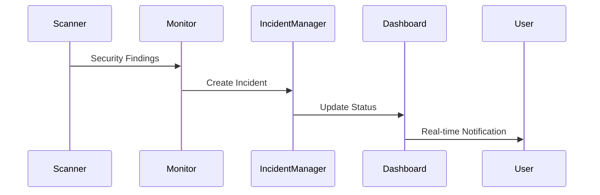

# Technical Documentation

## System Architecture

### Overview
The Serverless Security Platform is a comprehensive security monitoring and incident response system built on Azure Functions. It provides real-time security scanning, monitoring, and automated incident response capabilities.

### Core Components

1. **Security Scanner**
   - Base scanning interface
   - Dependency vulnerability scanner
   - Configuration scanner
   - Custom scanner support

2. **Security Monitor**
   - Real-time monitoring
   - Alert generation
   - Metric collection
   - Integration with Azure Application Insights

3. **Incident Response System**
   - Automated incident creation
   - Response workflow automation
   - Integration with external systems
   - Audit logging

4. **Dashboard**
   - Real-time updates via SignalR
   - Interactive visualizations
   - Incident management interface
   - Report generation

### System Flow



Setup Guide
Prerequisites

Python 3.9+
Azure Functions Core Tools
Azure CLI
Node.js 14+ (for dashboard)

Installation Steps

Clone the repository
Run scripts/setup_project.py
Configure Azure resources
Deploy the application

Configuration
Required environment variables:
plaintextCopyAZURE_STORAGE_CONNECTION_STRING=<connection-string>
AZURE_SIGNALR_CONNECTION_STRING=<connection-string>
APPLICATIONINSIGHTS_CONNECTION_STRING=<connection-string>
Development Guide
Adding New Scanners
To implement a new scanner:

Inherit from BaseScanner
Implement required methods
Register with SecurityMonitor

Example:

class CustomScanner(BaseScanner):
    async def scan(self) -> List[SecurityFinding]:
        # Implementation
        pass

    async def validate_configuration(self) -> bool:
        # Implementation
        pass

Testing
Run tests using:

pytest tests/

For specific test categories:

pytest tests/test_integration/  # Integration tests

pytest tests/test_performance/  # Performance tests

Deployment Guide
Azure Functions

Build the project
Deploy using Azure CLI
Configure application settings

Dashboard Deployment

Build frontend assets
Deploy to Azure Static Web Apps

Security Considerations
Authentication

Azure AD integration
Role-based access control
API security

Data Protection

Encryption at rest
Secure communication
Audit logging

Compliance

OWASP compliance
Security best practices
Regular security scanning

4. Create a test execution script:

```python
# scripts/run_tests.py

import subprocess
import sys
import os
import time
import argparse
from typing import List, Tuple

def run_test_suite(test_type: str) -> Tuple[bool, str]:
    """Run specified test suite and return results."""
    try:
        command = ['pytest']
        
        if test_type == 'unit':
            command.extend(['tests/test_unit', '-v'])
        elif test_type == 'integration':
            command.extend(['tests/test_integration', '-v'])
        elif test_type == 'performance':
            command.extend(['tests/test_performance', '-v'])
        elif test_type == 'all':
            command.extend(['tests/', '-v'])
        
        command.extend(['--cov=src', '--cov-report=term-missing'])
        
        result = subprocess.run(
            command,
            capture_output=True,
            text=True,
            check=True
        )
        
        return True, result.stdout
    except subprocess.CalledProcessError as e:
        return False, e.stdout + '\n' + e.stderr

def main():
    parser = argparse.ArgumentParser(description='Run test suites')
    parser.add_argument(
        '--type',
        choices=['unit', 'integration', 'performance', 'all'],
        default='all',
        help='Type of tests to run'
    )
    
    args = parser.parse_args()
    
    print(f"Running {args.type} tests...")
    success, output = run_test_suite(args.type)
    
    print(output)
    
    if not success:
        sys.exit(1)

if __name__ == '__main__':
    main()